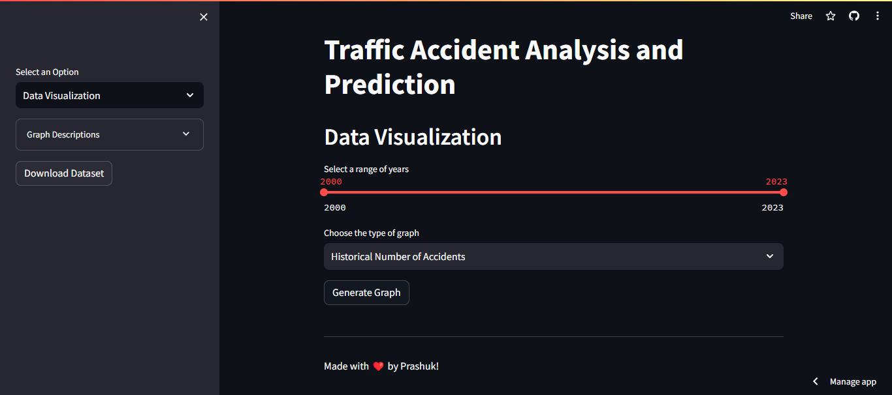
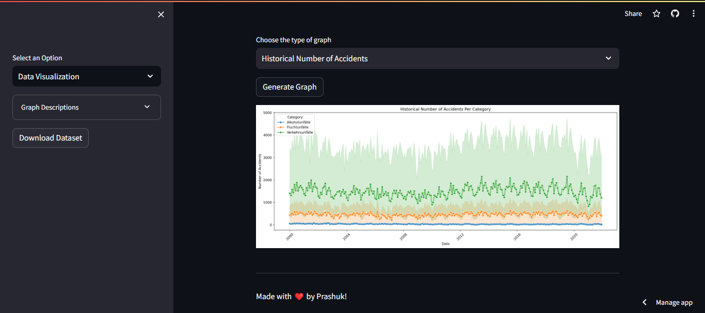
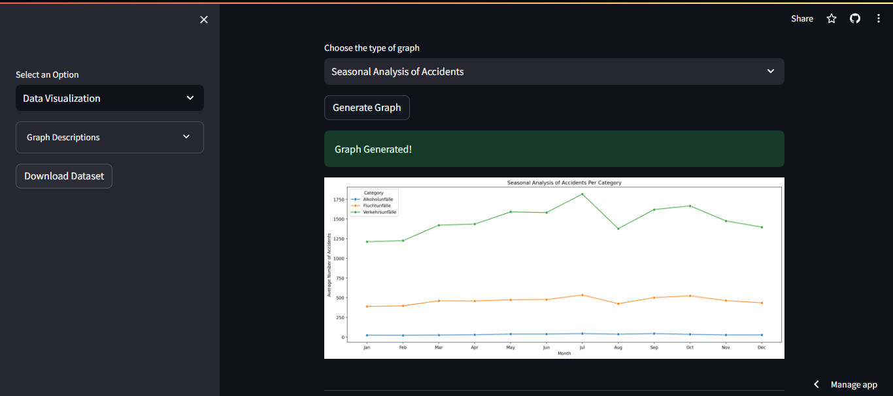
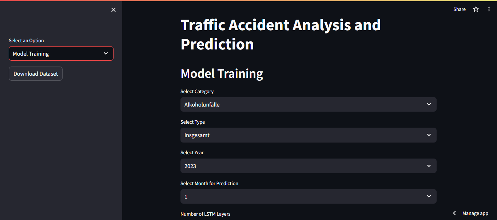
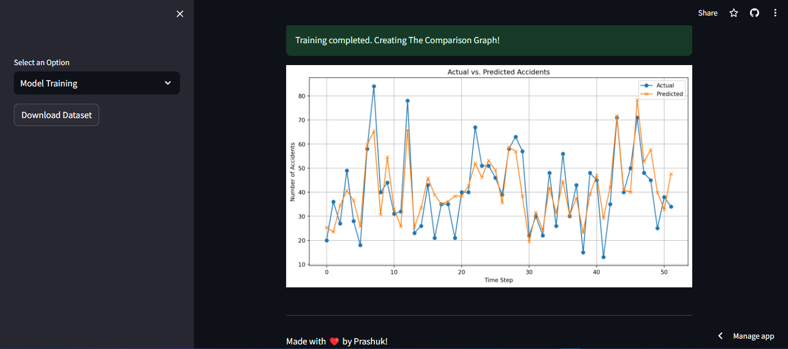

# 🚗 Traffic Accident Analysis and Prediction

🌐 Experience the live application here: [Traffic Accident Analysis App](https://accidentanalysis.streamlit.app/)

## Overview
This Streamlit application is an interactive tool for analyzing and predicting traffic accidents 📊. It enables users to visualize historical accident data and use a machine learning model 🧠 to predict future trends.

## Features

### Data Visualization 📈
- **Historical Data Plot**: Visualize the trend of traffic accidents over time.

- **Yearly Comparative Analysis**: Compare accidents annually across categories.

- **Seasonal Analysis**: Examine accident rates by month.

### Model Training 🤖 
- **Custom LSTM Configuration**: Configure and train an LSTM model.
- **Interactive Training**: Select parameters for model training.
- **Prediction Visualization**: Compare actual vs predicted accidents.

### User Interface 💻
- **Intuitive Sidebar**: Navigate between visualization and model training.
- **Download Dataset**: Access the dataset for offline analysis.

## Getting Started 🚀
### Installation
- Clone the repository and install dependencies from `requirements.txt`.
### Usage
- Run the application using Streamlit and explore different features through the sidebar.

## Detailed Implementation
### Data Handling
- The script starts by importing necessary libraries and the dataset.
- Functions for data preprocessing, normalization, and sequence generation are implemented for LSTM model readiness.

### Predictive Modeling
- An LSTM model is built and trained with user-defined parameters.
- The model predicts future traffic accident trends based on historical data.

### Contribution Guidelines
- Community contributions are encouraged to enhance the application's functionalities.

Made with ❤️ by Prashuk.
